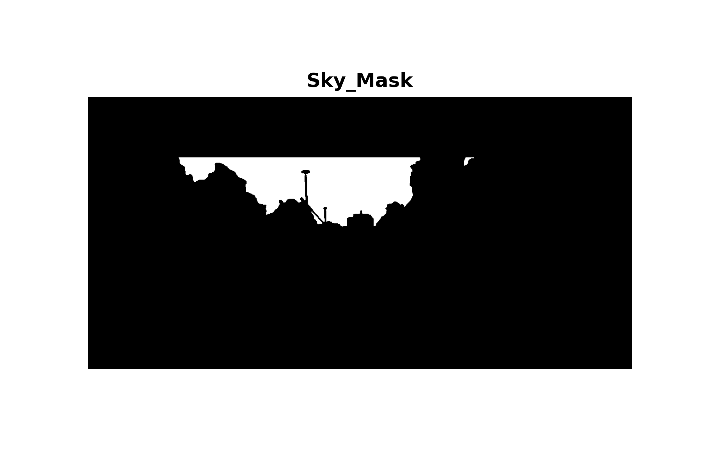

# Semantic Segmentation

## Overview

- [Semantic Segmentation](#semantic-segmentation)
  - [Overview](#overview)
    - [Instructions to setup](#instructions-to-setup)
    - [Project Structure](#project-structure)
      - [Visualisation](#visualisation)
    - [Training GIF](#training-gif)
    - [Training Curves](#training-curves)

### Instructions to setup

1. Clone this repository using the command `git clone ...` .
2. Install the required packages using this command `pip install -r requirements.txt`.
3. to train the model with given parameters run command `python main.py`
`

### Project Structure

```
semantic_segmentation
├── samples
│   ├── labels -> contain the labels segmentation map
│   │   │── labels.png
│   │── outputs -> contain the output segmentation map
|   |   │── output.png
│── constants.py -> contains all the outputs required bu the project
|── Exploratory Data Analysis.ipynb -> visualisation of labels segmentation map, masks, color coded segmentation map
|── datasets.py -> contains the class KittiDataset, loading of features, and labels
|── main.py -> file to train the model, on the given features, and labels 
|── model.py -> contains the SegmentationModel class, and the UpSample class
|── requirements.txt -> contains the list of required packages to run this project on local machine
|── utils.py -> contains utility functions like, train_model(), color_segmap(), plot results()
```

#### Visualisation

- Mask for individual classes:

<p align="center">
  
</p>

<p align="center">
  
</p>

<p align="center">
  
</p>

<p align="center">
  
</p>

- Color coded segmentation mask for all  given labels  :

<p align="center">
  
</p>

- Masks for all class for label_01  :

<p align="center">
  
</p>
 
### Training GIF

<p align="center">

</p>

### Training Curves
